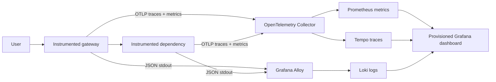

# Cloud Native Observability Lab

[](https://github.com/German4341374/cloud-native-observability-lab/actions/workflows/ci.yml)


A fully local observability platform that correlates metrics, logs, and distributed traces across
two instrumented TypeScript services. Controlled success, latency, HTTP error, and timeout scenarios
make it possible to investigate real signals instead of looking at an empty dashboard.

## Architecture



## What this demonstrates

- W3C trace propagation across a real HTTP service boundary.
- OpenTelemetry auto-instrumentation plus explicit business spans.
- Prometheus counters and histograms with bounded label cardinality.
- Pino JSON logs carrying trace and span IDs with credential redaction.
- Grafana Alloy container discovery and selective Loki ingestion.
- Provisioned Prometheus, Loki, Tempo, Grafana data sources and dashboard.
- Availability targets, latency targets, error budgets, burn rate, and multi-window paging logic.
- Controlled failures, health checks, graceful shutdown, resource isolation, and persistent volumes.
- Configuration validation, coverage gates, Trivy, Hadolint, and a full-stack CI smoke test.

## Quick start

Requirements: Docker Engine with Compose v2 and Node.js 24 for the helper scripts.

```bash
docker compose up --build --detach
node scripts/smoke.mjs
node scripts/failure-demo.mjs
```

Open:

- Grafana: `http://127.0.0.1:3000`
- Gateway: `http://127.0.0.1:8080/api/checkout?mode=success`
- Prometheus: `http://127.0.0.1:9090`
- Tempo readiness: `http://127.0.0.1:3200/ready`
- Loki readiness: `http://127.0.0.1:3100/ready`

Supported failure modes are `success`, `slow`, `error`, and `timeout`.

## Development checks

```bash
npm ci
npm run check
```

The check includes Prettier, strict ESLint, TypeScript, unit tests with coverage gates, and a
production build. GitHub Actions additionally validates Prometheus rules, dashboard JSON, Compose,
the Dockerfile, repository security, and the running telemetry stack.

## Security and privacy

- No external telemetry service or paid account is used.
- The application redacts authorization, cookies, bearer tokens, sensitive query values, and email.
- High-cardinality or personal identifiers are forbidden as metric labels.
- Grafana anonymous access is acceptable only because every published port binds to loopback.
- The Docker socket mount used by Alloy is read-only but still privileged; see [SECURITY.md](SECURITY.md).

## Limitations

- Single-process demo services and local storage are not horizontally available.
- The dashboard is intentionally small and focuses on RED signals and correlation.
- Alert rules are evaluated, but no external notification channel is configured.
- SLO thresholds are examples, not claims based on production traffic.

## Interview talking points

- Metrics answer how much; traces answer where; logs answer what happened.
- Route templates are safe labels, while raw URLs and IDs create cardinality explosions.
- Sampling, retention, alert windows, and telemetry backpressure are product and cost decisions.
- A trace/log link is useful only if propagation and redaction are reliable at every boundary.

Read [signal design](docs/signal-design.md), the [high latency runbook](docs/runbooks/high-latency.md),
and [DEMO.md](DEMO.md).
